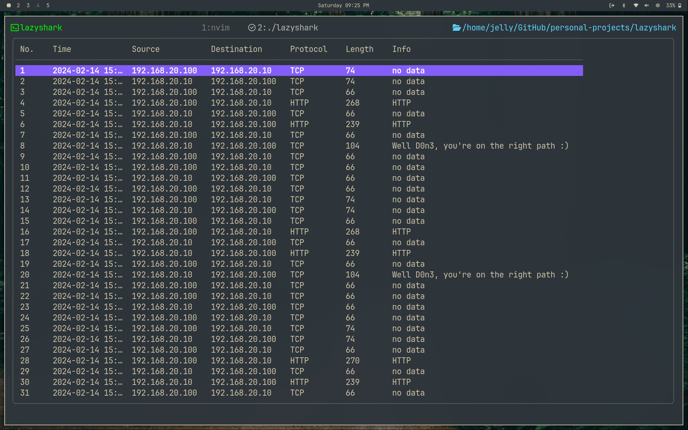
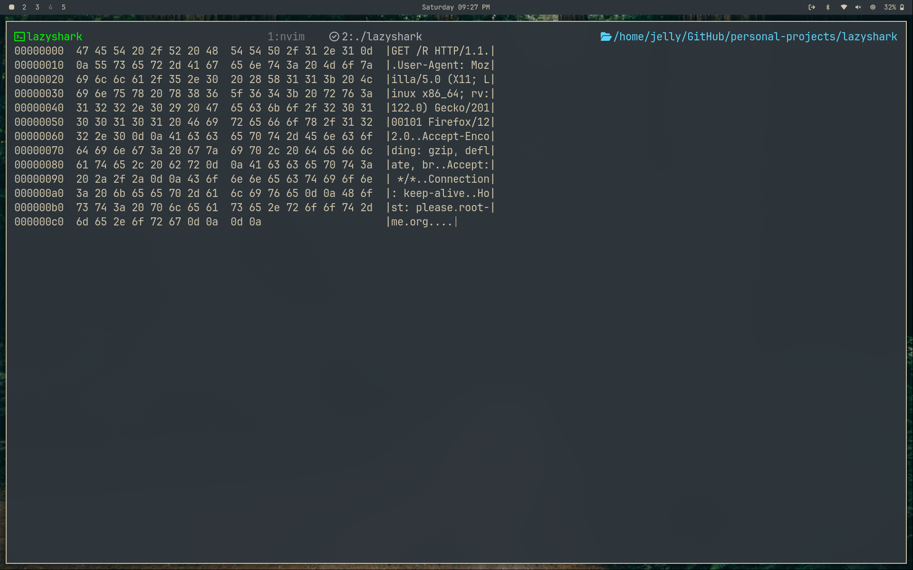

# lazyshark

A super simple pcap file visualizer.

## Overview

**lazyshark** is a lightweight terminal-based tool written in Go for visualizing and analyzing `.pcap` (packet capture) files. It allows users to quickly inspect network traffic by displaying packet summaries in a user-friendly terminal interface.

## Features

- Reads and displays packets from pcap files.
- Presents a tabular view of captured packets, including:
  - Packet Number
  - Timestamp
  - Source and Destination IPs
  - Protocol
  - Length
  - Info (e.g., HTTP detection)
- Terminal User Interface (TUI) powered by [Bubbletea](https://github.com/charmbracelet/bubbletea) and [Bubbles](https://github.com/charmbracelet/bubbles).
- Handles common keyboard actions (`q`, `ctrl+c` to quit).
- Protocol and application-level summary (basic HTTP detection).
---
## Sample image




---
## Usage


1. **Install Go** (if not already installed):  
   https://golang.org/doc/install

2. **Clone the repository:**
   ```sh
   git clone https://github.com/goushalk/lazyshark.git
   cd lazyshark
   ```

3. **Build the tool:**
   ```sh
   go build -o lazyshark ./cmd/packetbreather++
   ```

4. **Run lazyshark on a pcap file:**
   ```sh
   ./lazyshark -f path/to/your/file.pcap
   ```
OR 

Download the binary from the release

   - The TUI will display the packet list.
   - Use keyboard controls to navigate and quit.

## Example

```
$ ./lazyshark -f example.pcap
```
(You will see a terminal table with packet details.)

- To see the ascii/hex view use 'h'
- to come back to the table use 'backspace'

## Planned/Upcoming Features

- Detailed packet view
- Hex view of packet data

## License

This project is licensed under the [MIT License](LICENSE).

---

**Author:** [goushalk](https://github.com/goushalk)
